

  

  <a href="https://vitorcg.com.br">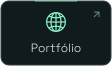</a>
  
  <a href="mailto:vittxw@gmail.com">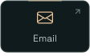</a>
  <a href="https://wa.me/5511944506528">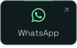</a>
  <a href="https://instagram.com/vittxw">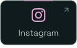</a>

## Sobre

- **Da interface ao deploy.** Desenvolvo aplicações web completas: interface, API e banco. Minha maior força é o front-end com React, Next.js e TypeScript — componentes tipados, estado previsível e performance. Prototipo em Figma antes de codar, tratando interface como decisão de produto.
- **Back-end e infraestrutura.** Laravel, Node e Java com Spring; APIs REST, WebSockets, JWT e PostgreSQL. Quando o projeto pede, cuido de infra e segurança na Cloudflare com DNS, WAF e rate limiting.
- **Formação e disponibilidade.** Estudo Java com Spring e curso Tecnólogo em Sistemas para Internet no SENAC, até dezembro de 2026. Aberto a CLT ou PJ, remoto ou híbrido em São Paulo.

<h2 align="center">Em produção</h2>

  <a href="https://aylo.me">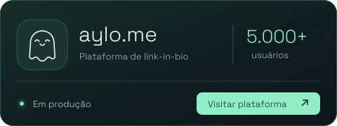</a>

Plataforma de link-in-bio que construí sozinho, do primeiro commit ao deploy, hoje rodando para mais de 5.000 usuários.

- Perfis e murais personalizáveis, autenticação JWT e PostgreSQL no Supabase
- Integrações sociais, ranking e comunicação em tempo real via WebSockets
- Monetização com planos VIP e pagamento integrado
- Infraestrutura na Cloudflare com DNS, WAF e rate limiting, além de proteção contra SQL Injection e CSRF

<code>React</code> · <code>TypeScript</code> · <code>Supabase</code> · <code>WebSockets</code> · <code>Cloudflare</code> 
Repositório privado

<h2 align="center">Stack</h2>

<table align="center">
  <tr>
    <td width="104" align="center" valign="middle"><strong>Front-end</strong></td>
    <td align="center" valign="middle">
      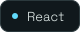
      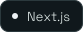
      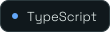
      
      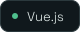
    </td>
  </tr>
  <tr>
    <td width="104" align="center" valign="middle"><strong>Back-end</strong></td>
    <td align="center" valign="middle">
      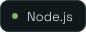
      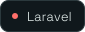
      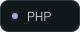
      
      
    </td>
  </tr>
  <tr>
    <td width="104" align="center" valign="middle"><strong>Dados e infraestrutura</strong></td>
    <td align="center" valign="middle">
      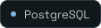
      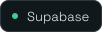
      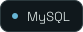 
      
      
      
      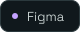
    </td>
  </tr>
</table>

<b>Ver o resto do ferramental</b>

 

**Também no dia a dia:** Express, Prisma, REST, WebSockets, autenticação JWT, Blade, Sass, Vite, Docker, Vercel, WAF e rate limiting na Cloudflare, SAP, Excel avançado, UiPath para RPA, Adobe XD, Framer Motion e GSAP.

**Métodos:** Kanban, Scrum, ITIL e COBIT.

**Idiomas:** português nativo e inglês intermediário, com leitura técnica e documentação.

## Outros projetos

| Projeto | O que é | Stack |
| --- | --- | --- |
| [Sorteio Speed Meeting](https://github.com/vitorcgo/Sorteio-SpeedMeeting) | Sorteio para eventos com importação de CSV, listagem por dia e painel administrativo. Cliente real | PHP · MySQL |
| [Flamexs E-commerce](https://github.com/vitorcgo/flamexs-ecommerce) | Loja com catálogo, carrinho, pedidos, autenticação e painel admin | Laravel · Blade · Tailwind |
| [MIMO](https://github.com/vitorcgo/MIMO-GerenciadordeGastos) | Gerenciador de gastos com parcelas, gráficos por categoria e tema claro e escuro | JavaScript · CSS |
| [Portfolio V3](https://github.com/vitorcgo/PortfolioV3) | Meu portfólio atual, com cena 3D em tempo real no navegador | Three.js · TypeScript |
| [classKey](https://github.com/vitorcgo/classKey-ProjetoIntegrador) | Painel administrativo para catálogo de jogos, projeto integrador do 2º semestre | PHP · SQLite |

Nos privados ficam o **CidadeDorme**, jogo multiplayer de papéis ocultos com salas, chat e votação em tempo real, o **IAChatBot-SHUI**, SAC com Google Gemini que classifica sentimento, categoria e urgência em FastAPI, e o **FilaZero**. Cases completos no [portfólio](https://vitorcg.com.br) e o resto do código nos [repositórios](https://github.com/vitorcgo?tab=repositories).

## Estatísticas

  

<picture>
  <source media="(prefers-color-scheme: dark)" srcset="./src/readme/pacman-contribution-graph-dark.svg" />
  <source media="(prefers-color-scheme: light)" srcset="./src/readme/pacman-contribution-graph.svg" />
  
</picture>

<h2 align="center">Ouvindo agora</h2>

<table align="center">
  <tr>
    <td width="112" align="center" valign="middle">
      
    </td>
    <td width="280" align="center" valign="middle">
      <strong>butterflies.</strong> 
      Brent Faiyaz · <em>Icon</em> (2026)  
      
    </td>
  </tr>
</table>

## Contato

Recrutador com vaga, cliente com projeto ou dev querendo trocar ideia: qualquer um dos caminhos funciona. Respondo em até 24 horas.

  
  
  
  <a href="https://github.com/vitorcgo">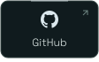</a>
   vittxw@gmail.com

