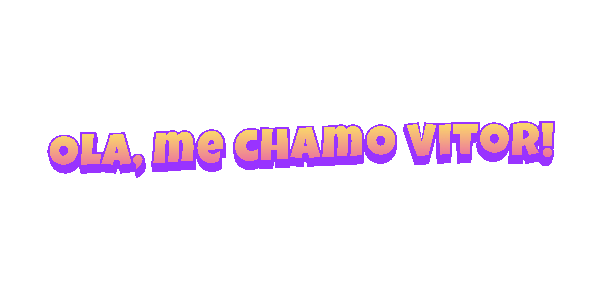

 

  
  

 
 
 💡 Programador Front-End com conceitos Back-End se formando pelo SENAC – Serviço Nacional de Aprendizagem Comercial, em Sistemas para Internet. Sou um profissional criativo com excelente raciocínio lógico e uma capacidade de aprendizagem rápida. Tenho experiência com criação de designs digitais e UI/UX.

 Minhas áreas de atuação incluem desenvolvimento web (front e back-end integrados a APIs), design digital, projetos freelance de design e programação.

💡 Habilidades Técnicas: 
🌟 Desenvolvimento Web: HTML, CSS, JavaScript, Sass, TailwindCSS, DaisyUI, jQuery, React, Ajax, Vite, PHP e TypeScript; 
🌟 Controle de Versão: Git/Github; 
🌟 Backend: Node.js, PHP, SQL, Laravel; 
🌟 Design e Prototipagem: Figma, AdobeXD e WordPress 

<h3 align="center">Entre em contato!</h3>

<picture align="center">
  <source media="(prefers-color-scheme: dark)" srcset="https://raw.githubusercontent.com/vitorcgo/vitorcgo/output/github-contribution-grid-snake-dark.svg">
  <source media="(prefers-color-scheme: light)" srcset="https://raw.githubusercontent.com/vitorcgo/vitorcgo/output/github-contribution-grid-snake-dark.svg">
  
</picture>

 

