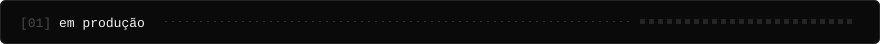
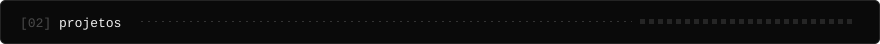
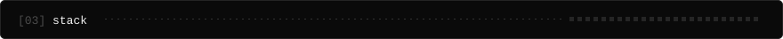
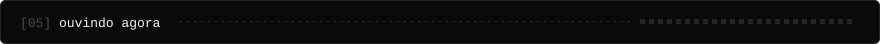
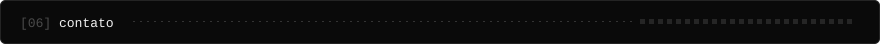

<a href="https://vitorcg.com.br"></a>

  
  
  
  
  





<a href="https://aylo.me"></a>

construí sozinho, do primeiro commit ao deploy · tempo real, planos pagos e infra na cloudflare



  <a href="https://github.com/vitorcgo/GameVitto"></a>
  <a href="https://github.com/vitorcgo/Niko"></a>
  <a href="https://github.com/vitorcgo/ChatBot-SHUI"></a>
  <a href="https://github.com/vitorcgo/Willow"></a>

mais cases no <a href="https://vitorcg.com.br">portfólio</a> · todo o código nos <a href="https://github.com/vitorcgo?tab=repositories">repositórios</a>





  
  
  



  

<picture>
  <source media="(prefers-color-scheme: dark)" srcset="./src/readme/pacman-contribution-graph-dark.svg" />
  <source media="(prefers-color-scheme: light)" srcset="./src/readme/pacman-contribution-graph.svg" />
  
</picture>



<a href="https://open.spotify.com/search/Brent%20Faiyaz%20butterflies"></a>



<a href="https://vitorcg.com.br"></a>

  
  
  
  

